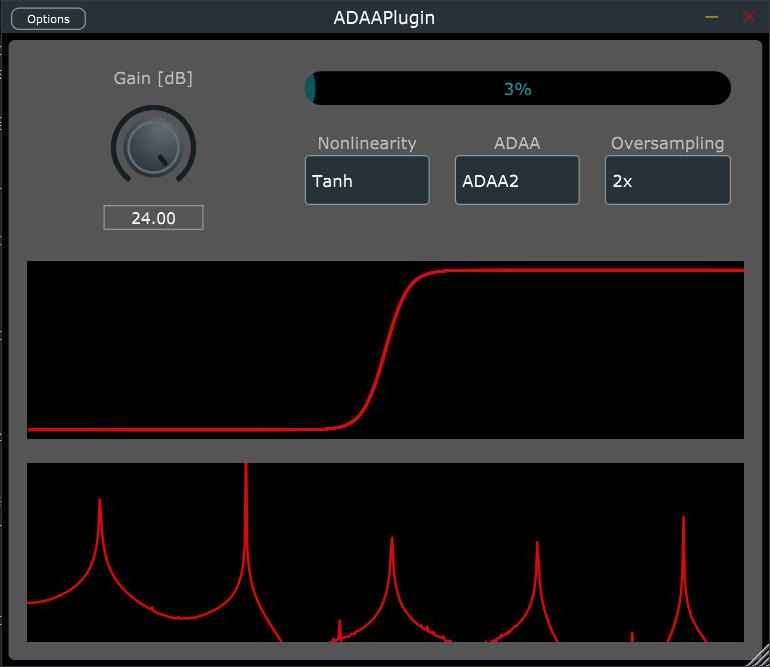

# Anti-derivative Antialiasing

[](https://opensource.org/licenses/BSD-3-Clause)

This repository contains an in-progress exploration of anti-derivative 
antialiasing (ADAA), a method for reducing aliasing artifacts in nonlinear
audio processing without the use of oversampling. The goal is to be
able to compare the effectiveness and computational cost of using
different ADAA algorithms, in a practical context.

Currently this repo contains a distortion effect built as an audio
plugin (VST3/AU), using the `tanh` and "hard clipping" nonlinearities.
Each nonlinearity is implemented 6 ways:

- standard implementation
- 1st-order ADAA
- 2nd-order ADAA
- Lookup-table
- Lookup-table w/ 1st-order ADAA
- Lookup-table w/ 2nd-order ADAA

Using these implementations, in conjunction with 2x, 4x, or 8x
oversampling, you can choose the optimal algorithm for your use
case, in terms of computational cost, sound quality, etc.

There are still a few bugs in this code, so please bear with me, as I
continue working on this code. In the future, I would like to
also include examples of stateful nonlinear functions and nonlinear
Wave Digital Filters using ADAA. Any and all contributions are welcome!



## Building

To build from scratch, you must have CMake installed.

```bash
# Clone the repository
$ git clone https://github.com/jatinchowdhury18/ADAA.git
$ cd ADAA

# initialize and set up submodules
$ git submodule update --init --recursive

# build with CMake
$ cmake -Bbuild
$ cmake --build build --config Release
```

## Literature

- [Reducing the Aliasing of Nonlinear Waveshaping using Continuous-Time Convolution](http://dafx16.vutbr.cz/dafxpapers/20-DAFx-16_paper_41-PN.pdf), Julian D. Parker, Vadim Zavalishin, Efflam Le Bivic, *DAFx-16*
- [Antiderivative Antialiasing for Memoryless Nonlinearities](https://aaltodoc.aalto.fi/bitstream/handle/123456789/30723/article5.pdf), Stefan Bilbao, Fabian Eqsueda, Julian D. Parker, Vesa Valimaki, *IEEE Signal Processing Letters, Vol. 24, No. 7*, July 2017
- [Antiderivative Antialiasing for Stateful Systems](http://dafx2019.bcu.ac.uk/papers/DAFx2019_paper_4.pdf), Martin Holters, *DAFx-19*
- [Antiderivative Antialiasing in Nonlinear Wave Digital Filters](https://dafx2020.mdw.ac.at/proceedings/papers/DAFx2020_paper_35.pdf), Davide Albertini, Alberto Bernardini, Augusto Sarti, *DAFx-20*

## License

Antiderivative Antialiasing is open source, and is licensed under the BSD 3-clause license.
Enjoy!
